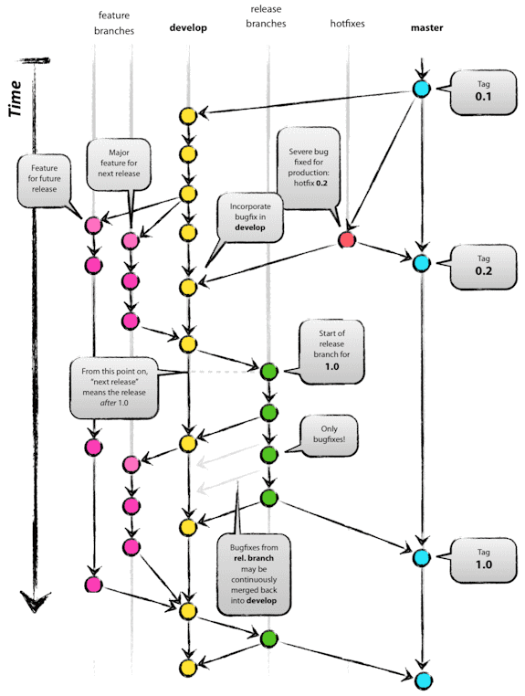

# SUJET_4ETI_AdmCO_20232024


**Activités AdmCo Partie 1 2023-2024**

Le rendu  est à faire en markdown sous github. L'idée est de partir d'un fork de ce projet. Le rendu est à faire en monôme . Les activités de codage sont à faire sous gitlab. L'ensemble des projets doit être privés et vous devez m'ajouter comme maintener . L'ensemble des liens gitlabs des questions doit être inclus dans le rapport github.

Héberger chaque question sur gitlab. Faite un tag 1.0 quand vous pensez que  l’exercice est finalisé. Donnez moi les droits maintener sur vos projets ( « fabricejumel »)

A part pour les questions Préparatoires , votre objectif est de  créer des dépots git pour chaque question.

l’idée est de faire mieux , en lien avec votre sujet (bien sûr) que ces deux exemples :

<https://gitlab.com/fabricejumel/rendufinal_bouyssoux/>

<https://gitlab.com/fabricejumel/tp1_ex8v0>

Il est demandé de ne pas utiliser visualcode (on peut l'utiliser en tant qu'editeur, mais pas d'usage des outils terminaux, git , etc ...)


## Questions Préparatoires

  1. Expliquer le code suivant  (addition.py):
```python
def add(x, y):

  z=x+y

  print('add() executed under the scope: ', __name__)

  return z

if __name__ == '__main__':

  x=input('Enter the first number to add: ')

  y=input('Enter the second number to add: ')

  result = add(int(x),int(y))

  print(x, '+', y,'=', result)

  print('Code executed under the scope: ', __name__)
```
Pour chaque question, indiquez vos sites choisis pour reference ( où le prompt de l'outil d'IA utilisé)

  1. A quoi sert requirments.txt ?

  1. A quoi ressemble un module en python ?

  1. A quoi ressemble un package ?

  1. Créer un code python utilisant sous forme de module addition.py

  1. A quoi sert pip ? 

  1. A quoi sert PYTHONPATH ?

  1. Où sont stockés les paquets installé par pip ?

  1. A quoi sert pip install –user ? 

  1. A quoi sert venv ? 

  1. Comment utiliser venv ?

  1. A quoi sert docker ?

  1. Comment utiliser docker ?

## Exercice 0

1. A quoi sert git config , Quelles sont les informtions minimales à renseigner. Est ce bien fait sur votre ordinateur ?

1. Quelles sont les commandes de bases git ? a quoi servent elles ? 

Expliquez a quoi correspond ce worklow et pourquoi c'est une bonne pratique 



  1. Créer un depot sur github TEST_worflowgit_NOM qui contient juste un fichier README. 
En vous inspirant [du lien suivant](https://github.com/fabricejumel/gitexamples_workflowgit/). Essayer de créer un ensemble de "commandes git " permettant d'avoir le plus exactement possible ( vous ferez des choix dans la cas ou ce n'est pas possible) le schéma précédent. Vous validerez par une commande d'affichage de git et une vision équivalente sur votre board github.

  1. Il est souvent plus simple de commencer son projet directement sur github ou gitlab en créant un README puis de le cloner avant de commencer à proprement parler son travail de développement. Proposer des modifications de la procedure vis à vis de l'exemple précedent qui tienne compte de ce changement et qui explique aussi à quelle moment procéder au push.

## Exercice 1

Créer un fichier python et coder 4 fonctions permettant de faire la somme, la différence, le produit et la division de 2 nombres complexes (sum, substract, mutliply, divide). 

On représentera les complexes par un tuple à 2 élements réels [4.67,5.89]. Cette Partie1 est entierement à but pedagogique. Il est à noté qu’une classe complexe existe en python mais ne sera pas utilisée .


Tester vos fonctions dans le même fichier


## Exercice 2

Creer une classe SimpleComplexCalculator proposant vos 4 méthodes


Tester votre classe dans le même fichier


## Exercice 3

Jeter un coup d’oeil sur les règles de codage en python (pep8,pep20), expliquer ce que vous avez du corriger dans votre code.

(utiliser par exemple  pylint et black)


## Exercice 4

Creer un package calculator contenant votre classe

Creer un package test contenant votre code de test de ce package/classe

Faites vos Commentaire sous forme de docstring, associé en particulier aux différentes méthodes


## Exercice 5

Tester dans vos méthodes de calcul que les entrées sont biens des entiers (avec par exemple isInstance(a, int) ), renvoyer **"ERROR"** si le calcul est impossible, au passage, gérer explicitement le cas de la division impossible par zero ( ex **raise** ZeroDivisionError(**"Cannot divide by zero"**) )


Tester le bon fonctionnement de ces améliorations


## Exercice 6

En utilisant unitest (**import** unittest)

dans votre classe test, mettre en place un ensemble de tests sur votre classe de calcul


## Exercice 7

En utilisant le système de gestion des logs (**import logging**)

Compléter vos classes de logs à la fois dans le cas où tout se passe bien et en cas de problème


## Exercice 8

Distribution de votre code. Creation d’une version zippé de votre projet.

Comment gérer de ne distribuer qu'une partie. Voir en particulier pour ne distribuer que la partie fonctionnelle , pas la partie test .


## Exercice 9

Création d’un package sur un repository pypi.

Creer vous un compte sur test.pypi.org

Apres avoir créer votre token, déposer la partie fonctionnelle de votre package. Faites l’installation


## Exercice 10

Peut-on installer directement les paquets à partir du repository gilab ? Cela est il aussi possible dans le cas de dépendances (requirement.txt) ?

Prise en main, de l'intégration continu proposé par gitlab. 

## Exercice 11

Prise en main, de l'intégration continu proposé par gitlab. 

Automatiser la phase de test et en cas de succès, la génération du .whl 

## Exercice 11 (Bonus)

Essayer d'automatiser la phase de déploiement sur Pypi depuis gitlab


## Exercice 12 

Montrer en quoi visualcode peut vous aider dans les différentes tâches associés aux exercices . Refaire l'ensemble en utilisant visualcode. Illustrer avec des copies d'ecrans quand vous utilisez les fonctionnalités et expliquer le résultat 


**Quelques liens** 

### systeme de fichier :

<https://doc.ubuntu-fr.org/arborescence>

<https://www.vermasachin.com/posts/5-python-package-management/>

<https://www.activestate.com/resources/quick-reads/python-dependencies-everything-you-need-to-know/>

<https://python-packaging-tutorial.readthedocs.io/en/latest/uploading_pypi.html>

### venv:

[<https://python.doctor/page-virtualenv-python-environnement-virtuel>](https://docs.python.org/fr/3/library/venv.html)


### log :

<https://docs.python.org/fr/3/howto/logging.html>

<https://realpython.com/python-logging/>

<https://www.loggly.com/ultimate-guide/python-logging-basics/>

<https://stackoverflow.com/questions/384076/how-can-i-color-python-logging-output>


### package

<https://python.doctor/page-python-modules-package-module-cours-debutants-informatique-programmation>

<https://realpython.com/python-modules-packages/>

<https://packaging.python.org/tutorials/installing-packages/>

<https://packaging.python.org/tutorials/packaging-projects/#packaging-your-project>

<https://www.programiz.com/python-programming/package>

<https://packaging.python.org/overview/>

<https://python.doctor/page-pip-installer-librairies-automatiquement>

<https://packaging.python.org/tutorials/packaging-projects/#packaging-your-project>

<https://python-packaging-tutorial.readthedocs.io/en/latest/setup_py.html>

http://cerfacs.fr/coop/python3_doc/pip_install/>

<https://pip.pypa.io/en/stable/reference/pip_uninstall/>

<https://choosealicense.com/>

<https://www.datacamp.com/community/tutorials/pip-python-package-manager>

<https://packaging.python.org/guides/distributing-packages-using-setuptools/>

[https://blog.ionelmc.ro/presentations/packaging/](https://blog.ionelmc.ro/presentations/packaging/#slide:1)

<https://docs.gitlab.com/ee/user/packages/pypi_repository/>

<https://deusyss.developpez.com/tutoriels/Python/packaging_pypi/>

<https://python-guide-pt-br.readthedocs.io/fr/latest/shipping/packaging.html>


### PEP8 :

<https://openclassrooms.com/fr/courses/4425111-perfectionnez-vous-en-python/4464230-assimilez-les-bonnes-pratiques-de-la-pep-8>

<https://python.doctor/page-pep-8-bonnes-pratiques-coder-python-apprendre>

<https://python.sdv.univ-paris-diderot.fr/15_bonnes_pratiques/>

<https://about.gitlab.com/handbook/business-ops/data-team/python-style-guide/>

<https://blog.impulsebyingeniance.io/outils-et-bonnes-pratiques-pour-un-code-python-de-bonne-qualite/>

<https://sphinxcontrib-napoleon.readthedocs.io/en/latest/example_google.html>


### black:

<https://python.doctor/page-black-code-formatter>

pylint et others :

<https://realpython.com/python-code-quality/>


### docstring :

<https://www.datacamp.com/community/tutorials/docstrings-python>

<https://www.geeksforgeeks.org/python-docstrings/>

<http://sametmax.com/les-docstrings/>

<https://sphinxcontrib-napoleon.readthedocs.io/en/latest/example_google.html>


### test:

<https://docs.python.org/fr/3.9/library/unittest.html>


### git :

<https://carlchenet.com/debuter-avec-git-creer-un-depot/>

<https://openclassrooms.com/fr/courses/1233741-gerez-vos-codes-source-avec-git>
<https://www.fil.univ-lille1.fr/~routier/enseignement/licence/poo/tdtp/gitlab.pdf>

<https://www.hostinger.fr/tutoriels/tuto-git/>

<http://lalloue.fr/blog/debuter-avec-visual-studio-code/>

<https://realpython.com/python-git-github-intro/>

<https://nvie.com/posts/a-successful-git-branching-model/>

<https://georgestocker.com/2020/03/04/please-stop-recommending-git-flow/>

<https://www.atlassian.com/fr/continuous-delivery/continuous-integration/trunk-based-development>

<https://about.gitlab.com/solutions/gitlab-flow/>

<https://dev.to/adityasridhar/how-to-use-git-efficiently-2pfa>

<https://buddy.works/blog/5-types-of-git-workflows>

<https://raygun.com/blog/git-workflow/>

<https://stackoverflow.com/questions/5601931/what-is-the-best-and-safest-way-to-merge-a-git-branch-into-master>

<https://git-scm.com/book/en/v2/Git-Branching-Basic-Branching-and-Merging>

### visualcode:

<https://binx.io/blog/2020/03/05/setting-python-source-folders-vscode/>


### débuter avec les modules

<https://docs.python-guide.org/writing/structure/>

<https://python.sdv.univ-paris-diderot.fr/14_creation_modules/>

<https://wiki.labomedia.org/index.php/Modules_et_sous-modules.html>

<https://courspython.com/modules.html>

<http://www.olivierberger.org/python/doc/tut/node8.html>

<https://www.devdungeon.com/content/python-import-syspath-and-pythonpath-tutorial>


